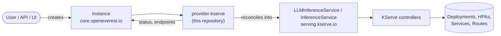

# KServe Provider

> [!WARNING]
> **Pre-alpha.** OpenEverest v2 and this provider are under active development. CRD schemas,
> chart values and defaults change frequently, including in breaking ways, and there is no
> supported upgrade path between versions yet. Not for production use.

<!-- Remove the pre-alpha banner and the status badge at v2 GA. -->

[](https://github.com/openeverest/openeverest)
[](https://github.com/openeverest/provider-kserve/actions/workflows/build.yaml)
[](https://pkg.go.dev/github.com/openeverest/provider-kserve)
[](LICENSE)

Serve **Large Language Models and predictive models** on Kubernetes through
[OpenEverest](https://github.com/openeverest/openeverest), backed by
[KServe](https://kserve.github.io/website/).

## What this is

OpenEverest providers translate a single, technology-agnostic `Instance` custom resource into
the native custom resources of an upstream Kubernetes operator — for databases, but equally
for caches, message queues, object storage, or model-serving runtimes. This repository is the
provider for **KServe**: it owns the technology-specific knowledge — topologies, versions,
parameters, gateway wiring — so that users, the API server, and the UI stay
technology-agnostic.

> [!IMPORTANT]
> **This provider is not standalone.** It requires an OpenEverest installation (core CRDs and
> controller) in the cluster. Installing this chart on its own does nothing.
> See [Install OpenEverest](https://openeverest.io/documentation/current/quick-install.html).



The provider watches `Instance` resources whose `spec.providerRef.name` is `provider-kserve`,
and reports workload health back onto `Instance.status`. It never manages pods directly — all
lifecycle work is delegated to the KServe controllers. Everything is created in
KServe's **Standard** mode (plain Deployments plus HPA, no Knative dependency); KServe
formerly called this mode `RawDeployment`.

## Compatibility

The latest release is `0.1.0`.

| provider-kserve | OpenEverest | KServe | Kubernetes |
|---|---|---|---|
| `0.1.0` | `>= 2.0.0-dev.2` | `0.20.x` | `1.30` – `1.34` |

## Capabilities

What you can do to a running instance through the `Instance` API. Upgrading the
provider itself is covered under [Installation](#installation).

| Capability | Status | Notes |
|---|---|---|
| Provisioning | ✅ | |
| Horizontal scaling | ✅ | `replicas`, or `minReplicas` / `maxReplicas` on the `predictor` component (`0` enables scale-to-zero) |
| Vertical scaling (CPU / memory) | ✅ | `spec.components.<name>.resources`; limits are mirrored into requests (Guaranteed QoS) |
| Version upgrades | ✅ | of the deployed serving runtime version — change `spec.version`; see [Versions](#versions) |
| Custom configuration | ✅ | structured parameters, plus an inline `LLMInferenceServiceConfig` escape hatch |
| Monitoring | ✅ | a `PodMonitor` per `llm` Instance; gateway token/cost metrics when the AI Gateway is enabled |
| TLS | ✅ | optional HTTPS on the shared Envoy AI Gateway, issued by cert-manager |

Models are pulled from the URI given in the component parameters (`hf://`, `s3://`, `gs://`,
`pvc://`), so this provider manages no persistent volumes and has no backup story.

## Installation

Install the published chart from the GHCR OCI registry:

```bash
helm install provider-kserve \
  oci://ghcr.io/openeverest/charts/provider-kserve \
  --version 0.1.0 --namespace everest-system
```

<details>
<summary>Install from a checkout (development)</summary>

```bash
git clone https://github.com/openeverest/provider-kserve.git
cd provider-kserve
make helm-deps   # helm dependency update (adds the jetstack repo for cert-manager)
helm install provider-kserve charts/provider-kserve --namespace everest-system
```

`make helm-install` does the same thing against your current kube context.
</details>

- The KServe controllers are bundled as chart dependencies and installed by default — see
  [Bundled KServe controllers](#bundled-kserve-controllers).
- cert-manager is bundled too, because both KServe controllers run admission webhooks. Set
  `cert-manager.enabled=false` when the cluster already provides it.

> [!NOTE]
> Installing cert-manager in the *same* Helm release as the resources that consume it can
> race — the cert-manager webhook may not be ready when the KServe `Issuer` / `Certificate`
> objects are admitted. If a first install fails on a cert-manager webhook error, either
> re-run it or install cert-manager first with `cert-manager.enabled=false`. The dev
> [Tiltfile](dev/Tiltfile) does the latter automatically.

Uninstall:

```bash
helm uninstall provider-kserve --namespace everest-system
```

Uninstalling the chart does **not** delete running `Instance` resources, and it does
**not** delete the KServe CRDs (they are installed from the chart's `crds/` directory,
which Helm never removes). See [KServe CRDs](#kserve-crds).

## Usage

Verify that the provider registered itself:

```bash
kubectl get providers.core.openeverest.io provider-kserve
```

Create an instance:

```yaml
apiVersion: core.openeverest.io/v1alpha1
kind: Instance
metadata:
  name: llama-31-8b
spec:
  providerRef:
    name: provider-kserve
  topology:
    type: llm
  components:
    llmEngine:
      type: vllm
      replicas: 1
      parameters:
        modelURI: hf://meta-llama/Llama-3.1-8B-Instruct
```

Component names are defined by this provider — see [definition/provider.yaml](definition/provider.yaml).
`spec.topology.type` is **required**: this provider has no default topology.
Complete manifests live in [examples/](examples/):

- [examples/instance-llm.yaml](examples/instance-llm.yaml) — Llama 3.1 8B with vLLM.
- [examples/instance-llm-cpu.yaml](examples/instance-llm-cpu.yaml) — a small model on CPU
  (compute profile, KV cache sizing, inline advanced config).
- [examples/instance-predictor.yaml](examples/instance-predictor.yaml) — an sklearn model.

Watch it come up and read the connection details:

```bash
kubectl get instance llama-31-8b -w
kubectl get instance llama-31-8b -o jsonpath='{.status.connection}'
```

## Topologies

<!-- BEGIN GENERATED: topologies -->
| Topology | Default | Description |
|---|---|---|
| `llm` | | Large Language Models served with vLLM through `LLMInferenceService` (`v1alpha2`) — OpenAI-compatible endpoints, tensor/pipeline parallelism, Gateway API inference routing, optional disaggregated prefill/decode (llm-d pattern) |
| `predictor` | | Predictive models through `InferenceService` (`v1beta1`) — sklearn, pytorch, tensorflow, xgboost, onnx, triton, huggingface, … KServe auto-selects a `ServingRuntime` from the model format |
<!-- END GENERATED: topologies -->

There is no default: an `Instance` without `spec.topology.type` is rejected.

## Versions

<!-- BEGIN GENERATED: versions -->
| Version bundle | Default | llmEngine (vLLM) | predictor (KServe) |
|---|---|---|---|
| `0.20` | ✅ | `0.25.1` | `0.20.0` |

One bundle, matching the single set of KServe controllers the chart installs. The
llmEngine version is the CPU profile's vLLM build; the bundled GPU presets run
KServe's own runtime image and are not selectable here.
<!-- END GENERATED: versions -->

Source of truth: [definition/versions.yaml](definition/versions.yaml).

## Configuration

- **Chart values:** [charts/provider-kserve/values.yaml](charts/provider-kserve/values.yaml)
- **Instance parameters:** per-component and per-topology `parameters` schemas, defined under
  [definition/](definition/) and published on the `Provider` resource
  (`kubectl get provider provider-kserve -o yaml`). The API server and the UI validate user
  input against these schemas.

### `llmEngine` (vllm) parameters

| Field | Type | Description |
|---|---|---|
| `modelURI` | string | Model artifacts location (`hf://`, `s3://`, `gs://`, `pvc://`). **Required.** |
| `modelName` | string | Name advertised in the request `model` field. Defaults to the Instance name. |
| `tensorParallelSize` | int32 | vLLM tensor parallelism (`--tensor-parallel-size`). |
| `pipelineParallelSize` | int32 | vLLM pipeline parallelism (`--pipeline-parallel-size`). |
| `dataParallelSize` | int32 | vLLM data parallelism (`ParallelismSpec.data`); common for Mixture-of-Experts replica layouts. Mutually exclusive with `pipelineParallelSize`; the provider mirrors it into `dataLocal` for a single-node layout. |
| `expertParallel` | string | `enabled` / `disabled` (default) expert parallelism (`ParallelismSpec.expert`) for MoE models (Mixtral, DeepSeek, Qwen-MoE). |
| `computeProfile` | string | `gpu` (default) uses the bundled CUDA presets; `cpu` composes the CPU-only `kserve-config-llm-cpu` config via `baseRefs`. See [Compute profile](#compute-profile-cpu-serving). |
| `kvCacheSpaceGi` | int32 | Caps `VLLM_CPU_KVCACHE_SPACE` on the CPU profile. |
| `baseRefs` | []string | `LLMInferenceServiceConfig` names to inherit/merge. |
| `config` | string | Inline `LLMInferenceServiceConfig` spec body. See [Advanced customization](#advanced-customization-inline-config). |
| `disableStorageInitializer` | bool | Skip the storage-initializer init container. |

### `predictor` (modelServer) parameters

| Field | Type | Description |
|---|---|---|
| `modelFormat` | string | Model framework (e.g. `sklearn`). **Required.** |
| `storageURI` | string | Model artifacts location. **Required.** |
| `runtimeVersion` | string | Pin the serving runtime version. |
| `runtime` | string | Explicitly select a (Cluster)ServingRuntime by name. |
| `minReplicas` | int32 | Autoscaling floor (`0` enables scale-to-zero). |
| `maxReplicas` | int32 | Autoscaling ceiling. |

### `llm` topology parameters

| Field | Type | Description |
|---|---|---|
| `externalAccess` | string | Client access path: `ClusterIP`, `LoadBalancer`, `NodePort`, or `EnvoyAIGateway`. Takes precedence over `enableAIGateway` and `llmEngine.service.serviceType`. |
| `enableGatewayRouting` | bool | Provision a Gateway API route plus Inference Gateway scheduler (Endpoint Picker) for prefix-cache aware routing. |
| `enableAIGateway` | bool | Legacy alias for `externalAccess: EnvoyAIGateway` when `externalAccess` is unset. |
| `tokenLimitPerHour` | int32 | Per-user, per-model hourly token quota. Only valid with Envoy AI Gateway. Defaults to 1000 when a Redis/Valkey rate-limit backend is configured. |
| `enablePrefill` | bool | Enable disaggregated serving with a separate prefill workload. |
| `prefillReplicas` | int32 | Replicas for the prefill workload (when `enablePrefill` is true). |
| `enableMetrics` | bool | Emit a vLLM PodMonitor for this instance (`/metrics`). Defaults to enabled. |
| `enableTracing` | bool | Enable KServe distributed tracing (OTLP) across gateway/scheduler/model. Disabled by default. |
| `tracingEndpoint` | string | Optional OTLP exporter endpoint (`OTEL_EXPORTER_OTLP_ENDPOINT`); used only when `enableTracing` is true. |

### Accessing the model

vLLM serves an OpenAI-compatible API on **port 8000**. In Standard mode KServe only
creates an in-cluster `ClusterIP` Service, so how you reach the model depends on
`spec.topology.parameters.externalAccess` (or the legacy
`spec.components.llmEngine.service.serviceType`):

| Access | What the provider does | How to connect |
|---|---|---|
| `ClusterIP` (default) | Nothing extra — uses KServe's in-cluster Service | Port-forward, or call it from another pod at the reported host |
| `LoadBalancer` | Creates an owned Service of type `LoadBalancer` fronting the model pods | `curl http://<lb-address>:8000/v1/models` |
| `NodePort` | Creates an owned Service of type `NodePort` | `curl http://<node-ip>:<nodePort>/v1/models` |
| `EnvoyAIGateway` | Registers the model on the shared Envoy AI Gateway | Gateway URL plus token quotas (see below) |

For `LoadBalancer` / `NodePort` the endpoint is published in the Instance's connection
details once the address is assigned (a `LoadBalancer` reports Ready without an address while
the cloud/k3d LB is still provisioning). `LoadBalancer` also honours `service.annotations`
(e.g. cloud LB tuning) and `service.loadBalancerService.sourceRanges` (allowed CIDRs).

To reach a `ClusterIP` model from your laptop, port-forward the KServe workload Service:

```bash
kubectl port-forward svc/<instance>-kserve-workload-svc 8000:8000
curl http://localhost:8000/v1/models
```

> This is plain Kubernetes exposure. The KServe-native Gateway API path
> (`enableGatewayRouting`) is separate and additionally provisions a managed `Gateway` plus
> `HTTPRoute` and the Inference Gateway scheduler.

### Envoy AI Gateway

The normal `llm` path publishes KServe's direct URL and can still be consumed with the
port-forward workflow. Envoy AI Gateway is an independent, opt-in access path that gives all
opted-in models one OpenAI-compatible entry point, token metering, and optional per-user
token quotas.

Enable the bundled controllers and shared `LoadBalancer` Gateway:

```yaml
# values.yaml
aiGateway:
  enabled: true
```

TLS is optional and exposes the shared Gateway over HTTPS on port 443 using a cert-manager
`Issuer` or `ClusterIssuer`. See the [Envoy AI Gateway TLS guide](docs/ai-gateway-tls.md) for
DNS-01 production setup, Let's Encrypt staging, cloud DNS providers, and local self-signed
tests.

Then enable it on an Instance:

```yaml
spec:
  topology:
    type: llm
    parameters:
      externalAccess: EnvoyAIGateway
      tokenLimitPerHour: 1000
```

(`enableAIGateway: true` still works when `externalAccess` is unset.)

The provider creates an `AIGatewayRoute` that matches the request body's `model` value and
routes directly to the `InferencePool` generated by `LLMInferenceService`. It does not create
an `AIServiceBackend`; that resource is for the classic `InferenceService` Service backend and
would bypass KServe's LLM endpoint picker.

When the Gateway receives an external address, that base URL replaces the direct KServe URL in
the Instance connection details. Send requests to the standard endpoint:

```bash
curl "$GATEWAY_URL/v1/chat/completions" \
  -H 'Content-Type: application/json' \
  -H 'x-user-id: user123' \
  -d '{
    "model": "llama-3.1-8b-instruct",
    "messages": [{"role": "user", "content": "Hello"}]
  }'
```

Token metering is always configured on AI routes. Global quota enforcement also needs an
existing Redis-compatible service. Configure its address in the Envoy Gateway subchart values:

```yaml
envoyGateway:
  config:
    envoyGateway:
      rateLimit:
        backend:
          type: Redis
          redis:
            url: valkey.default.svc.cluster.local:6379
```

When the URL is omitted, no `BackendTrafficPolicy` is created. When configured, the quota is
keyed by both `x-user-id` and model, request cost is zero, and the response's
`llm_total_token` metadata is charged. Exhausted quotas return HTTP 429. Gateway TLS does not
add API-key authentication or backend TLS; configure those separately before exposing the
endpoint to untrusted networks.

### Model catalog

The models offered in the `llm` topology's **Model** dropdown are **not** hardcoded in the
generated schema — they are driven by the chart's `.Values.models` and rendered into the
`Provider` CR at install time (`spec.uiSchema.llm.modelCatalog`). Edit the list to add,
remove, or reorder models; changes take effect on `helm upgrade`, with no regeneration
required.

```yaml
# values.yaml
models:
  - label: "Qwen2.5 0.5B Instruct"     # shown in the dropdown
    uri: "hf://Qwen/Qwen2.5-0.5B-Instruct"
  - label: "Llama 3.2 1B Instruct"
    uri: "hf://meta-llama/Llama-3.2-1B-Instruct"
    gated: true                         # adds a "(gated)" suffix; needs a token
```

| Field | Type | Description |
|---|---|---|
| `label` | string | Display name shown in the UI. |
| `uri` | string | Model location (`hf://`, `s3://`, `pvc://`, …). |
| `gated` | bool | Optional. Marks a model that needs a HuggingFace token (see below). Gated entries get a `(gated)` suffix in the UI. |

The default catalog ships a range of ungated models (including tiny, CPU-friendly ones such as
SmolLM2 135M/360M, Qwen2.5 0.5B, and TinyLlama 1.1B) plus common gated models.

> The UI resolves the dropdown from `spec.uiSchema.llm.modelCatalog` on the `Provider` CR
> (there is no runtime ConfigMap lookup), which is why the catalog is rendered from Helm
> values rather than read at request time. It lives under `spec.uiSchema` because that is the
> Provider CRD's only `PreserveUnknownFields` region — a top-level `spec.modelCatalog` field
> would be pruned by the apiserver as an unknown field. It is nested inside the `llm` topology
> node (not a top-level `uiSchema` key) so it is not enumerated as a selectable topology in
> the UI's topology dropdown.

### LoRA adapter catalog

When **LoRA deployment** is enabled in the `llm` wizard, adapter slots are populated from
`.Values.loraAdapters`, rendered into `spec.uiSchema.llm.loraCatalog` on the `Provider` CR,
and passed to the provider pod as `LORA_ADAPTER_CATALOG` for validation at reconcile time.

```yaml
# values.yaml
loraAdapters:
  - label: "SQL assistant"              # shown in the slot dropdown
    name: sql-lora                        # OpenAI `model` field in requests
    uri: "hf://my-org/sql-lora-adapter"
  - label: "Code style"
    name: code-style
    uri: "s3://my-bucket/adapters/code-style"
```

| Field | Type | Description |
|---|---|---|
| `label` | string | Display name in the UI slot picker. |
| `name` | string | Served adapter name (must differ from the base model name). |
| `uri` | string | Adapter weights location (`hf://`, `s3://`, `pvc://`, …). |

The default catalog ships a few tiny public HuggingFace LoRA adapters paired with
models in the model list (SmolLM2-135M, Qwen2.5-0.5B). Replace with your own
adapters for production.

#### Gated models (HuggingFace token)

Gated models (Llama, Mistral, Gemma, …) require a HuggingFace token and prior access approval.
Create a `Secret` holding the token — with an **`HF_TOKEN`** key — in the **same namespace as
your `Instance`s**, before deploying them:

```bash
kubectl create secret generic hf-token --from-literal=HF_TOKEN=hf_xxx
```

Then point the provider at it:

```yaml
# values.yaml
huggingface:
  tokenSecretName: hf-token
```

When set, the provider attaches the secret to a dedicated `<instance>-model-puller`
`ServiceAccount` on each `llm` workload, so KServe's storage-initializer authenticates the
download and injects `HF_TOKEN`. Leave `tokenSecretName` empty to disable — only ungated
models will then download.

> **Limitation:** when Gateway API routing (`enableGatewayRouting`) is enabled, KServe manages
> its own workload `ServiceAccount` and ignores the provider's, so the token is not injected
> in that combination. Gated downloads without gateway routing work as described.

### Compute profile (CPU serving)

The bundled `LLMInferenceServiceConfig` presets use a CUDA (GPU) vLLM image. To serve a model
on nodes without a GPU, set the `computeProfile` parameter to `cpu` (exposed as the **Compute
Profile** selector in the UI). The provider then adds the chart-shipped
`kserve-config-llm-cpu` config to the service's `baseRefs`, which strategic-merges a CPU-only
vLLM image over the base template. Because the base command uses the generic `vllm` CLI, only
the image changes — the command, env, and probes are inherited.

Configure the CPU image in the chart:

```yaml
cpuProfile:
  enabled: true
  image: vllm/vllm-openai-cpu:v0.25.1
```

The config is rendered into the release namespace alongside the other presets, so it resolves
for instances in any namespace. It requires `llmPresets.enabled` (it layers onto those
presets). Use `baseRefs` directly if you need a fully custom `LLMInferenceServiceConfig`
instead.

#### CPU memory sizing

vLLM CPU has a large, model-independent runtime footprint — the torch import and compilation
in the worker consume **several GiB before the model or KV cache are loaded** (it can be
~5 GiB even for a 125M model). On top of that, vLLM is **not** cgroup-aware, and two
independent startup checks apply:

- **Startup reservation** — vLLM reserves `--gpu-memory-utilization` × the detected memory (on
  the CPU backend this flag controls *CPU* memory despite its name; default `0.92`) and
  validates it against the memory that is *free* when the worker starts. Once the runtime
  footprint is loaded, the 0.92 default overshoots what is free and fails with
  `Available memory on node … on startup is less than desired CPU memory utilization`.
- **KV cache** — `VLLM_CPU_KVCACHE_SPACE`, if set, then carves the KV cache out of that
  reservation and is likewise checked against free memory.

To make the CPU profile start on a modest node, the `kserve-config-llm-cpu` preset applies a
set of default vLLM args (`cpuProfile.defaultArgs`) to the model-server container:

```yaml
cpuProfile:
  defaultArgs:
    - --gpu-memory-utilization=0.3   # don't pre-grab 92% of memory
    - --enforce-eager                # skip torch.compile
    - --max-model-len=2048           # smaller context = smaller KV arena
```

These flow into the vLLM command as container args. To override them for a single instance,
set `args` on the `main` container in the topology's **Advanced** (inline
`LLMInferenceServiceConfig`) section — KServe treats a container's `args` as atomic, so your
list **replaces** the preset defaults entirely (re-specify any you still want):

```yaml
config: |
  template:
    containers:
      - name: main
        args:
          - --gpu-memory-utilization=0.5
          - --max-model-len=4096
```

Set **CPU KV Cache Space** (`parameters.kvCacheSpaceGi`) only to additionally cap
`VLLM_CPU_KVCACHE_SPACE`.

The provider also mirrors the memory (and CPU) **limit into the request** (Guaranteed QoS) so
the scheduler reserves that memory on the node.

**Size memory generously.** Because of the multi-GiB runtime floor, a tight limit (e.g. 8 GiB)
leaves too little free for even a modest reservation and fails the startup check regardless of
model size. Give CPU instances enough headroom above that floor, and/or lower
`--gpu-memory-utilization`.

### Advanced customization (inline config)

The structured fields cover the common knobs (model, resources, parallelism, KV cache). For
anything else — extra vLLM args, environment variables, scheduling — use the **Advanced**
section (`llmEngine.parameters.config`) to author an inline `LLMInferenceServiceConfig` **spec
body**:

```yaml
components:
  llmEngine:
    parameters:
      config: |
        template:
          containers:
            - name: main
              args:
                - --enforce-eager      # skip torch.compile (lowers CPU memory)
                - --max-model-len=2048 # cap context length (shrinks KV cache)
```

On reconcile the provider materializes this as an `LLMInferenceServiceConfig` named
`<instance>-config` in the Instance's namespace, owned by the Instance (so it is
garbage-collected with it), and attaches it to the `LLMInferenceService` via `baseRefs`. It is
applied **last**, so it overrides the compute-profile preset and any `baseRefs` you set, while
the Instance's own structured fields (model, resources, the derived KV cache env) still win
over it. Enter only the config spec body — the provider supplies the metadata.

To reference *pre-existing* shared configs instead of authoring one inline, list their names in
`llmEngine.parameters.baseRefs` (API-only).

### Deployment and networking

See [docs/deployment-guide.md](docs/deployment-guide.md) for how the Envoy AI Gateway gets an
external address across different environments:

- **Cloud** (AWS EKS, GCP GKE, Azure AKS) — works out of the box
- **On-prem GPU clusters** (DGX, HGX) — use MetalLB, kube-vip, or PureLB
- **GPU cloud** (CoreWeave, Lambda, RunPod) — varies by provider
- **Local development** (k3d, kind, minikube) — MetalLB or `minikube tunnel`

### Observability

Each `llm` Instance gets a `PodMonitor` so an existing Prometheus Operator scrapes vLLM's
`:8000/metrics` (on by default; safely skipped when the `monitoring.coreos.com` CRDs are
absent). See [docs/observability.md](docs/observability.md) and the
[vLLM Grafana dashboard](docs/dashboards/vllm.json).

When the AI Gateway is enabled, the chart also scrapes gateway `gen_ai.*` token/cost metrics.
See [docs/observability-gateway.md](docs/observability-gateway.md) and
[docs/dashboards/gateway.json](docs/dashboards/gateway.json).

## Bundled KServe controllers

The provider only *translates* `Instance`s into KServe custom resources — it does not
reconcile them. The controllers that do are bundled as Helm subchart dependencies so a single
`helm install` yields a working stack:

| Dependency | Reconciles / provides | Toggle |
|---|---|---|
| `kserve-resources` | `InferenceService` (predictor) | `kserveResources.enabled` |
| `kserve-llmisvc-resources` | `LLMInferenceService` (llm) | `kserveLlmisvcResources.enabled` |
| `kserve-runtime-configs` | `ClusterServingRuntime`s (predictor) | `kserveRuntimeConfigs.enabled` |
| `cert-manager` | webhook certificates for both | `cert-manager.enabled` |

The KServe CRDs are **not** subchart dependencies — they are vendored into the chart's
`crds/` directory (see [KServe CRDs](#kserve-crds)).

The `kserve-runtime-configs` chart ships the `ClusterServingRuntime`s the InferenceService
controller selects from by model format — without them the `predictor` topology has no runtime
to schedule.

The `LLMInferenceServiceConfig` presets (`kserve-config-llm-template`, …) that the llmisvc
controller merges into every `LLMInferenceService` are **not** taken from that subchart.
Upstream hardcodes them to the `kserve` namespace, and the llmisvc controller resolves presets
from its own pod namespace (`POD_NAMESPACE`), which would force the whole stack into `kserve`.
Instead the provider vendors the preset file (see `make sync-llm-presets`) under the chart's
`files/llmisvcconfigs/` directory and renders it into the **release namespace** (toggle
`llmPresets.enabled`). This is what lets the provider install into any namespace. Without the
presets the `llm` topology stalls with `ConfigNotFound: kserve-config-llm-template`.

Both controllers default to KServe's **Standard** mode (plain Deployments plus HPA, no
Knative/Istio), matching the deployment mode the provider annotates on every `InferenceService`
it creates. `kserve-resources` owns the shared KServe resources (config `ConfigMap`, self-signed
`Issuer`, `ClusterStorageContainer`); the llmisvc chart has them disabled to avoid collisions
within one release.

Vendor the dependencies before installing from a checkout:

```bash
make helm-deps   # helm dependency update (adds the jetstack repo for cert-manager)
```

## KServe CRDs

Installing the provider chart also installs the KServe CustomResourceDefinitions the provider
translates `Instance`s into (`InferenceService`, `LLMInferenceService`, and their supporting
kinds). `make helm-deps` vendors them from the `kserve-crd` and `kserve-llmisvc-crd` charts —
pinned to the same version as the controller charts in
[`Chart.yaml`](charts/provider-kserve/Chart.yaml) — into the chart's `crds/` directory.

Helm installs `crds/` **before** rendering any templates, so a single `helm install`
can create the CRs this chart ships (`ClusterServingRuntime`, `ClusterStorageContainer`,
`LLMInferenceServiceConfig`). Keeping them out of `templates/` is deliberate: Helm renders a
subchart's templates in the same pass as those CRs, which fails on a fresh cluster with
`resource mapping not found ... ensure CRDs are installed first`.

The `crds/` mechanism has trade-offs to know about:

- `helm uninstall` does **not** delete the CRDs (or the objects of those kinds). They are
  left in place.
- `helm upgrade` does **not** update the CRD schemas. When you bump the KServe version,
  apply the new CRDs out of band with `kubectl apply -f charts/provider-kserve/crds/`
  (or `--server-side`) after `make helm-deps`.
- Skip installing them with `--skip-crds` when the cluster already has the CRDs (shared
  cluster or BYO-KServe):

```bash
helm install provider-kserve oci://ghcr.io/openeverest/charts/provider-kserve \
  --version 0.1.0 --namespace everest-system --skip-crds
```

> [!NOTE]
> The cert-manager CRDs are **not** bundled. The KServe controllers' `Certificate`
> resources require them, so install cert-manager (with its CRDs) before, or alongside
> with, this chart.

The `LLMInferenceServiceConfig` presets are still vendored by `make sync-llm-presets`
into `files/llmisvcconfigs/`. When you bump the KServe version, bump the four KServe
entries in `Chart.yaml` together and re-run `make generate` for the preset file.

```bash
make helm-deps         # vendor the CRDs into crds/ and the controller charts into charts/
make sync-llm-presets  # refresh charts/provider-kserve/files/ from $(KSERVE_CHARTS)
```

## Development

Requires Go (see [go.mod](go.mod)), Docker, Helm, kubectl, and a Kubernetes cluster you can
reach. For local development we recommend [k3d](https://k3d.io) — `make dev-up` creates the
cluster for you.

```bash
make dev-up             # local k3d cluster + Tilt dev environment
make generate           # RBAC, provider spec, vendored presets, Helm chart sync
make run                # run the provider locally against the cluster
make test               # unit tests
make test-reconcile     # fast chainsaw suites under test/reconcile/
make test-e2e           # slow chainsaw suites under test/e2e/ (real models)
make dev-down
```

To work against a cluster you already have — kind, GKE, a shared dev cluster — skip
`make dev-up` and point Tilt at it:

```bash
cp dev/.env.example dev/.env   # set K8S_CONTEXT, and DOCKER_REGISTRY_URL for a remote registry
tilt up -f dev/Tiltfile
```

`make help` lists every target. `make verify` fails when generated files are stale — run
`make generate` and commit the result.

The provider contract (`Validate` / `Sync` / `Status` / `Cleanup`), RBAC markers, watches,
and code generation are documented once for all providers in
[PROVIDER_DEVELOPMENT.md](https://github.com/openeverest/provider-sdk/blob/main/PROVIDER_DEVELOPMENT.md).

> **Note:** `go.mod` requires the published `github.com/kserve/kserve` module tag directly (no
> local `replace`). The accompanying alignment directives pin `controller-runtime` and
> `k8s.io` versions to match KServe's (KEDA v2.18 compatibility).

### Layout

| Path | Purpose |
|---|---|
| `cmd/provider/` | Entry point |
| `internal/provider/` | `ProviderInterface` implementation, AI Gateway wiring, RBAC markers |
| `internal/common/` | Component name constants |
| `definition/` | Provider identity, component types, versions, topologies |
| `charts/provider-kserve/` | Helm chart (`generated/` and `files/` are produced by `make generate`) |
| `config/rbac/role.yaml` | Generated `ClusterRole` — do not edit |
| `docs/` | Deployment, TLS and observability guides, Grafana dashboards |
| `test/reconcile/` | Fast chainsaw suites (`llm`, `predictor`): the CR the provider derives, and its garbage collection |
| `test/e2e/` | Slow chainsaw suites: a real model served end to end. Manually gated, not run per PR |
| `test/vars.sh` | Pinned KServe and workload versions used by tests |
| `examples/` | Example `Instance` resources |
| `dev/` | Tilt dev environment, `.env` configuration, k3d cluster config |
| `hack/` | Helper scripts used by the Makefile |
| `.github/workflows/` | CI: lint, build, unit and integration tests, release |

### Testing

- **Unit tests** — `make test`.
- **Reconcile tests** — chainsaw suites under [test/reconcile/](test/reconcile/), one per
  topology. They assert what the provider deterministically controls: the spec of the KServe
  CR it derives from an `Instance`, and that the CR is garbage collected when the `Instance`
  is deleted. Fast, and run on every pull request.
- **E2E tests** — chainsaw suites under [test/e2e/](test/e2e/): a real model taken to a
  serving state. Minutes per test, so they are manually gated rather than run per PR.
- **CI** — [.github/workflows/build.yaml](.github/workflows/build.yaml) and
  [.github/workflows/test.yaml](.github/workflows/test.yaml) run lint, build, unit tests,
  generated-file verification, Helm lint, and each reconcile suite on every pull request. The
  e2e suite has its own trigger and does not run automatically.

## Troubleshooting

```bash
kubectl logs -n everest-system deploy/provider-kserve -f
```

| Symptom | Where to look |
|---|---|
| `Instance` stuck in `Creating` | `kubectl describe instance <name>` conditions, then the provider logs |
| No `Provider` resource in the cluster | Is the chart installed? Check the provider deployment logs |
| `Instance` ignored entirely | `spec.providerRef.name` must be `provider-kserve` |
| `unsupported topology ""` | `spec.topology.type` is required — set `llm` or `predictor` |
| `ConfigNotFound: kserve-config-llm-template` | The LLM presets are missing; keep `llmPresets.enabled=true` |
| `predictor` instance has no runtime | `kserve-runtime-configs` must be installed |
| Install fails on a cert-manager webhook error | Re-run, or install cert-manager first with `cert-manager.enabled=false` |
| CPU model fails with "less than desired CPU memory utilization" | Raise the memory limit or lower `--gpu-memory-utilization` — see [CPU memory sizing](#cpu-memory-sizing) |
| Gated model download fails | Create the `HF_TOKEN` secret and set `huggingface.tokenSecretName` |

## Contributing

Issues and pull requests are welcome. See
[PROVIDER_DEVELOPMENT.md](https://github.com/openeverest/provider-sdk/blob/main/PROVIDER_DEVELOPMENT.md)
and the [OpenEverest Code of Conduct](https://github.com/openeverest/openeverest/blob/main/CODE_OF_CONDUCT.md).

## Security

Report vulnerabilities per the
[OpenEverest security policy](https://github.com/openeverest/openeverest/blob/main/SECURITY.md).
Please do not open public issues for security reports.

## License

Apache License 2.0 — see [LICENSE](LICENSE) for details.
