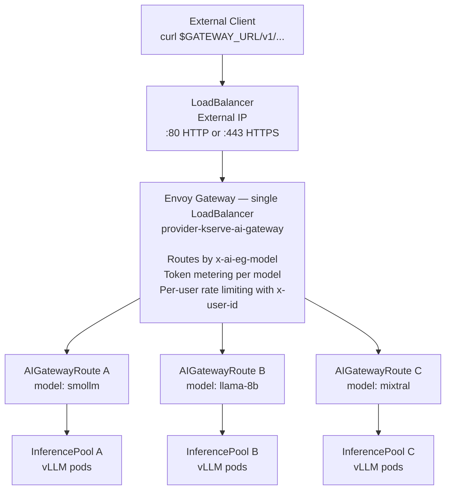

# Envoy AI Gateway TLS

For a public cloud endpoint, configure an existing cert-manager `Issuer` or
`ClusterIssuer`. The provider chart creates the `Certificate`, stores it in a
Secret in the release namespace, and exposes the shared Gateway over HTTPS on
port 443.

```yaml
aiGateway:
  enabled: true
  tls:
    enabled: true
    hostname: llm.example.com
    issuerRef:
      name: letsencrypt-prod
      kind: ClusterIssuer
```

`aiGateway.tls.secretName` can override the generated Secret name. The issuer
itself is intentionally not created by this chart because ACME solvers and
cloud DNS credentials are cluster-specific. Envoy terminates the client TLS
connection so AI Gateway can inspect the OpenAI request for model routing,
authentication, metering, and rate limiting. Backend traffic remains
cluster-internal; configure separate backend TLS if encryption to the model pod
is required.

The cloud request flow is:



## DNS-01 certificates

DNS-01 is the recommended production setup. The ACME server validates a
temporary DNS TXT record, so the Gateway does not need to expose port 80 and
the model GPU nodes do not need public addresses. Only the Envoy
`LoadBalancer` is exposed; TLS configuration is the same for GPU workloads on
any Kubernetes provider.

Prerequisites:

1. cert-manager is running. This chart installs it by default; if the cluster
   already has it, set `cert-manager.enabled=false`.
2. You control the hostname's DNS zone and can create a restricted DNS API
   credential.
3. The hostname has an `A` or `AAAA` record, or a suitable `CNAME`, pointing to
   the Envoy Gateway load balancer.
4. A cert-manager DNS-01 solver exists for the DNS provider. See the
   cert-manager documentation for Route53, Cloud DNS, Azure DNS, Cloudflare,
   or webhook-based providers.

First locate cert-manager's namespace. A `ClusterIssuer` reads referenced
credentials from cert-manager's configured cluster-resource namespace, which
is normally the namespace containing its controller:

```sh
CERT_MANAGER_NAMESPACE=$(
  kubectl get deployment -A \
    -l app.kubernetes.io/name=cert-manager \
    -o jsonpath='{.items[0].metadata.namespace}'
)
echo "$CERT_MANAGER_NAMESPACE"
```

For example, create a least-privilege Cloudflare token that can edit DNS for
the required zone, then store it without committing it to the repository:

```sh
kubectl create secret generic cloudflare-api-token \
  --namespace "$CERT_MANAGER_NAMESPACE" \
  --from-literal=api-token="$CLOUDFLARE_API_TOKEN"
```

Create a staging issuer first to avoid Let's Encrypt production rate limits:

```yaml
apiVersion: cert-manager.io/v1
kind: ClusterIssuer
metadata:
  name: letsencrypt-staging
spec:
  acme:
    email: platform@example.com
    server: https://acme-staging-v02.api.letsencrypt.org/directory
    privateKeySecretRef:
      name: letsencrypt-staging-account
    solvers:
      - dns01:
          cloudflare:
            apiTokenSecretRef:
              name: cloudflare-api-token
              key: api-token
```

Apply it and wait for ACME account registration:

```sh
kubectl apply -f clusterissuer.yaml
kubectl wait clusterissuer/letsencrypt-staging \
  --for=condition=Ready --timeout=120s
```

Configure the provider release:

```yaml
cert-manager:
  # Use false when cert-manager is already managed by the cluster.
  enabled: false

aiGateway:
  enabled: true
  gatewayService:
    type: LoadBalancer
  tls:
    enabled: true
    hostname: llm.example.com
    issuerRef:
      name: letsencrypt-staging
      kind: ClusterIssuer
```

After applying the Helm values, point `llm.example.com` at the external address
reported by the Gateway or its generated Service. DNS-01 issuance itself only
uses the TXT record, but normal clients still need this address record to reach
Envoy:

```sh
kubectl get gateway
kubectl get service -A \
  -l gateway.envoyproxy.io/owning-gateway-name=provider-kserve-ai-gateway
kubectl get certificate,certificaterequest,challenge
kubectl wait certificate/provider-kserve-ai-gateway \
  --for=condition=Ready --timeout=300s
```

Let's Encrypt staging certificates are intentionally not publicly trusted, so
use `curl -k` during the staging test. Once routing and issuance work, create a
production issuer by changing the ACME server and account Secret:

```yaml
metadata:
  name: letsencrypt-prod
spec:
  acme:
    server: https://acme-v02.api.letsencrypt.org/directory
    privateKeySecretRef:
      name: letsencrypt-prod-account
```

Then change only `aiGateway.tls.issuerRef.name` to `letsencrypt-prod`. A
production request should validate without `-k`:

```sh
curl https://llm.example.com/v1/chat/completions \
  -H 'Content-Type: application/json' \
  -H 'x-user-id: user123' \
  -d '{
    "model": "llama-3.1-8b-instruct",
    "messages": [{"role": "user", "content": "Hello"}]
  }'
```

For Route53, Cloud DNS, or Azure DNS, replace only the solver and its
credentials. Prefer workload identity, IRSA, or managed identity over static
cloud keys when the DNS provider supports it.

## Local TLS testing

GPU availability does not affect TLS. A local CPU model, local GPU cluster, or
cloud GPU cluster all sit behind the same Envoy listener.

For a quick local connectivity test, create a self-signed issuer:

```yaml
apiVersion: cert-manager.io/v1
kind: ClusterIssuer
metadata:
  name: selfsigned
spec:
  selfSigned: {}
```

Enable TLS with a local hostname:

```yaml
aiGateway:
  enabled: true
  tls:
    enabled: true
    hostname: llm.local
    issuerRef:
      name: selfsigned
      kind: ClusterIssuer
```

Resolve that hostname to the MetalLB or other local load-balancer address
without changing public DNS:

```sh
GATEWAY_IP=$(kubectl get gateway provider-kserve-ai-gateway \
  -o jsonpath='{.status.addresses[0].value}')

curl -k --resolve "llm.local:443:${GATEWAY_IP}" \
  https://llm.local/v1/chat/completions \
  -H 'Content-Type: application/json' \
  -H 'x-user-id: local-test' \
  -d '{
    "model": "smollm",
    "messages": [{"role": "user", "content": "Say hello"}]
  }'
```

The `-k` flag is expected for self-signed certificates. DNS-01 can also be used
from a local cluster when you control a real DNS zone because the ACME
validation only checks DNS. Use `--resolve` to direct the resulting public
hostname to the local load-balancer IP while testing. HTTP-01 is not currently
the recommended path for this chart: TLS mode exposes only the HTTPS listener,
whereas Gateway API HTTP-01 requires a reachable port-80 listener and
cert-manager Gateway API support.
