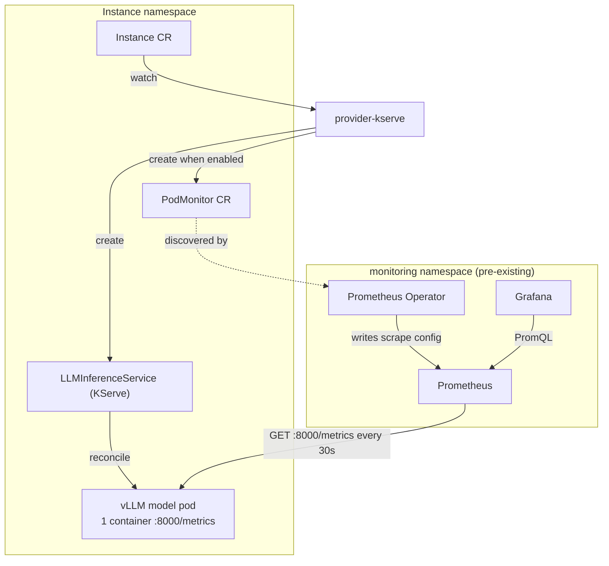
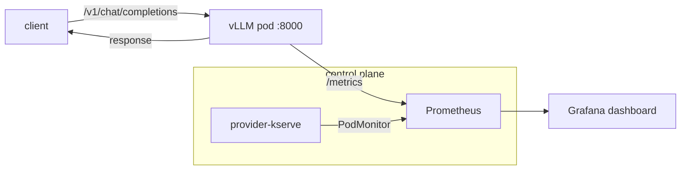

# Observability

This provider makes its LLM model workloads **discoverable** by a Prometheus
that already exists in the cluster. It ships **no** monitoring stack (no
Prometheus, no Grafana) and adds **no** metric-aggregation code — vLLM already
exposes Prometheus metrics on a single endpoint, so there is nothing to
aggregate.

> **Not qpext.** KServe's [`qpext`](https://github.com/kserve/kserve/blob/master/qpext/README.md)
> extends the Knative **queue-proxy** sidecar to merge two containers' metrics
> onto one port. It only applies to Serverless/Knative mode. This provider runs
> everything in **RawDeployment** mode — one container per model pod, one
> `/metrics` endpoint — so `qpext` is irrelevant here.

## How it works

When `metrics.podMonitor.enabled` is on (the default), the provider creates one
`PodMonitor` (`monitoring.coreos.com/v1`) per `llm` Instance, owned by that
Instance. The Prometheus Operator turns that `PodMonitor` into a scrape job; the
existing Prometheus then scrapes the vLLM `:8000/metrics` endpoint directly.



The provider's part is just the `PodMonitor`. Everything else (Operator,
Prometheus, Grafana) is platform infrastructure the provider does not own.

## Enabling / disabling

Metrics are **on by default** and safe to leave on: if the
`monitoring.coreos.com` CRDs are not installed, the provider **skips** emitting
the `PodMonitor` instead of erroring the reconcile. Install the Prometheus
Operator later and the next reconcile emits it automatically.

```yaml
# values.yaml
metrics:
  podMonitor:
    enabled: true     # default; set false to never emit a PodMonitor
    interval: 30s     # scrape interval
```

```bash
# turn it off for a release
helm upgrade provider-kserve ... --set metrics.podMonitor.enabled=false
```

## The one gotcha that actually bites: selector scoping

A `PodMonitor` is only honored if the Prometheus resource's
`podMonitorSelector` / `podMonitorNamespaceSelector` matches it. Many clusters
set these to "match everything"; some filter by label or namespace. If yours
filters, the `PodMonitor` is created but **silently ignored**.

**First thing to check when "no vLLM metrics show up":**

```bash
# 1. Is the PodMonitor there?
kubectl get podmonitor -n <instance-namespace>

# 2. Does the pod actually serve metrics?
kubectl port-forward -n <instance-namespace> pod/<vllm-pod> 8000:8000
curl -s localhost:8000/metrics | grep '^vllm:' | head

# 3. Does Prometheus select PodMonitors in this namespace?
kubectl get prometheus -A \
  -o jsonpath='{range .items[*]}{.metadata.name}{": podMonitorSelector="}{.spec.podMonitorSelector}{" nsSelector="}{.spec.podMonitorNamespaceSelector}{"\n"}{end}'
```

If step 3 shows a selector that excludes your namespace/labels, that is a
Prometheus configuration change (outside this provider): widen the selector or
label the namespace/`PodMonitor` to match.

Other gotchas:

- **CRD absent** → handled: the provider skips, logs at `-v1`, does not error.
- **Namespace rule** → a `PodMonitor` (default `namespaceSelector`) matches only
  pods in **its own** namespace; the provider places it alongside the workload,
  which is correct.
- **Port** → hardcoded to `8000` (the vLLM OpenAI server port, which also serves
  `/metrics`). A different runtime port is a parameter to `buildPodMonitor`.
- **Orphans on disable** → flipping the flag off does not delete existing
  `PodMonitor`s; they are harmless and garbage-collected when the Instance is
  deleted.
- **Drift** → the `PodMonitor` is not watched (owning that watch would fail the
  manager on CRD-less clusters), so a manual edit/delete is corrected on the
  next periodic resync, not instantly.

## PodMonitor vs ServiceMonitor

Both are Prometheus Operator CRs that generate scrape config; they differ in
what they target.

| | PodMonitor (used here) | ServiceMonitor |
|---|---|---|
| Targets | Pods, by pod labels | Services → the backing Endpoints |
| Needs a Service? | No | Yes |
| Port by | container port number/name | Service port **name** |
| Best when | you own the pods but not a stable Service | you have a Service with a well-named metrics port |

**Why PodMonitor here:** the KServe workload `Service` is KServe-owned and its
port name is not guaranteed stable across versions, and it is `ClusterIP`-only
(the provider's external Service exists only for `LoadBalancer`/`NodePort`). A
`PodMonitor` selects the workload pods directly by labels the provider already
stamps, targeting port `8000` by **number** — so nothing depends on Service or
container-port naming.

## What metrics a vLLM pod gives you

vLLM exposes Prometheus metrics at `:8000/metrics`, all prefixed `vllm:`. These
are LLM-specific signals you cannot get from generic pod metrics.

| Metric | Type | What it tells you |
|---|---|---|
| `vllm:num_requests_running` | gauge | Requests actively decoding right now |
| `vllm:num_requests_waiting` | gauge | Queued requests (backlog) — scale-up signal |
| `vllm:gpu_cache_usage_perc` | gauge | KV-cache utilization (0–1); ~1.0 = memory-bound |
| `vllm:cpu_cache_usage_perc` | gauge | CPU KV-cache utilization (CPU serving) |
| `vllm:prefix_cache_hits_total` / `_queries_total` | counter | Prefix-cache effectiveness (matters for gateway/EPP routing) |
| `vllm:prompt_tokens_total` | counter | Input tokens processed — throughput & cost |
| `vllm:generation_tokens_total` | counter | Output tokens generated — throughput & cost |
| `vllm:time_to_first_token_seconds` | histogram | **TTFT** — perceived responsiveness |
| `vllm:time_per_output_token_seconds` | histogram | **TPOT / inter-token latency** — streaming smoothness |
| `vllm:e2e_request_latency_seconds` | histogram | Full request latency |
| `vllm:request_queue_time_seconds` | histogram | Time spent waiting before running |
| `vllm:request_prefill_time_seconds` / `_decode_time_seconds` | histogram | Prefill vs decode split (llm-d disaggregated path) |
| `vllm:request_success_total` | counter | Completions, labeled by `finished_reason` (stop/length) |
| `vllm:num_preemptions_total` | counter | Requests preempted under memory pressure (bad sign) |
| `vllm:iteration_tokens_total` | histogram | Tokens processed per engine step (batch efficiency) |
| `process_*`, `python_*` | — | Standard `prometheus_client` process metrics |

> Metric names track upstream vLLM and can shift slightly between versions.
> Confirm against a live pod with `curl localhost:8000/metrics | grep '^vllm:'`.

### Handy PromQL

```promql
# Output throughput (tokens/s)
sum(rate(vllm:generation_tokens_total[1m]))

# p95 time-to-first-token
histogram_quantile(0.95, sum(rate(vllm:time_to_first_token_seconds_bucket[5m])) by (le))

# Queue pressure
vllm:num_requests_waiting

# KV-cache saturation
vllm:gpu_cache_usage_perc
```

## Grafana dashboard

A ready-to-import dashboard lives at
[`docs/dashboards/vllm.json`](dashboards/vllm.json). Panels: token throughput,
running vs waiting requests, TTFT, TPOT, KV-cache usage, end-to-end latency, and
success/preemptions. It has `Namespace` and `Model` template variables (built
from the `namespace` and `model_name` labels).

**Import:** Grafana → Dashboards → New → Import → upload `vllm.json` → pick your
Prometheus data source.

**Provision automatically** (kube-prometheus-stack / Grafana sidecar) by wrapping
it in a labeled ConfigMap:

```bash
kubectl create configmap vllm-dashboard \
  --from-file=vllm.json=docs/dashboards/vllm.json \
  -n monitoring \
  --dry-run=client -o yaml \
  | kubectl label -f - --local -o yaml grafana_dashboard=1 \
  | kubectl apply -f -
```

## Gateway (token / cost) metrics

The vLLM pod metrics above are the *engine's* inside view — one set per model
pod, each seeing only its own traffic. The **Envoy AI Gateway** (enabled with
`aiGateway.enabled`) adds the complementary **front-door** view: for every
request that entered the system, which model was called, the input/output
**token counts** (the basis for cost/billing), request duration, TTFT and TPOT.
No single vLLM pod can give you this — it is a per-model/per-route aggregate the
shared gateway alone sees.

### Ownership: why this one lives in the chart, not the provider

The vLLM `PodMonitor` is **per-Instance** — the provider emits one per `llm`
Instance in Go (`syncLLM`), because each Instance has its own model pods. The AI
Gateway is a **singleton** — installed once by the chart, shared by every
Instance. A per-Instance reconcile is the wrong place for a singleton's monitor
(N Instances would fight to own one object), so the gateway `PodMonitor` is a
**chart template** (`templates/ai-gateway-podmonitor.yaml`), rendered once next
to the Gateway and gated by `aiGateway.enabled AND metrics.podMonitor.enabled`.

> Rule: **per-Instance workload → provider Go; singleton infra → chart template.**
> Both happen to be `PodMonitor`s — the *kind* was never the distinction, the
> *owner/lifecycle* is.

### The scrape target (a PodMonitor, not a ServiceMonitor)

The `gen_ai.*` metrics are emitted by the AI Gateway filter on the **Envoy proxy
data-plane pods**, on a container port named **`aigw-admin`** at **`/metrics`** —
*not* behind a Service. So the monitor must be a `PodMonitor`. Those proxy pods
are labeled by Envoy Gateway (`app.kubernetes.io/name=envoy`,
`app.kubernetes.io/component=proxy`) and live in Envoy Gateway's namespace
(`envoy-gateway-system` by default), hence `namespaceSelector: {any: true}`.

> **Gotcha (Prometheus 3):** the gateway emits OTel-native names, which
> Prometheus 3 scrapes *dotted* (`gen_ai.client.token.usage`) by default,
> breaking PromQL. The chart sets `scrapeProtocols: [PrometheusText0.0.4]` on
> the `PodMonitor` so names render underscored
> (`gen_ai_client_token_usage`). See
> [envoyproxy/ai-gateway#1051](https://github.com/envoyproxy/ai-gateway/issues/1051).
> vLLM does not need this — it emits classic Prometheus text.

### What the gateway gives you

| Metric | Type | What it tells you |
|---|---|---|
| `gen_ai_client_token_usage` | histogram | Tokens processed; label `gen_ai_token_type` splits `input`/`output`/`total` — **cost basis** |
| `gen_ai_server_request_duration` | histogram | Full request duration at the gateway filter |
| `gen_ai_server_time_to_first_token` | histogram | **TTFT** as the front door saw it |
| `gen_ai_server_time_per_output_token` | histogram | **TPOT** / inter-token latency |

Common attributes: `gen_ai_request_model`, `gen_ai_operation_name`
(`chat`/`completion`/`embedding`/…), `gen_ai_provider_name`.

```promql
# Tokens/s per model, input vs output
sum by (gen_ai_request_model, gen_ai_token_type) (
  rate(gen_ai_client_token_usage_sum{gen_ai_token_type!="total"}[5m]))

# Total tokens per model over the last hour (cost/usage)
sum by (gen_ai_request_model) (
  increase(gen_ai_client_token_usage_sum{gen_ai_token_type="total"}[1h]))

# p95 request duration at the gateway
histogram_quantile(0.95,
  sum by (le) (rate(gen_ai_server_request_duration_bucket[5m])))
```

> Port name/path track Envoy AI Gateway upstream and can shift between versions.
> Confirm against a live proxy pod: `kubectl port-forward <envoy-proxy-pod> ...`
> then `curl localhost:<aigw-admin>/metrics | grep gen_ai`.

### Gateway dashboard

A ready-to-import dashboard lives at
[`docs/dashboards/gateway.json`](dashboards/gateway.json). Panels: token-usage
rate by model & type, request rate, TTFT, TPOT, request duration, and total
tokens per model. Import it exactly like the vLLM dashboard (upload, or wrap in a
`grafana_dashboard=1`-labeled ConfigMap for the Grafana sidecar).

## Whole architecture (data path)



The serving path (left) and the metrics path (right) are independent: metrics
scraping never sits in the request path, so it cannot add serving latency.
