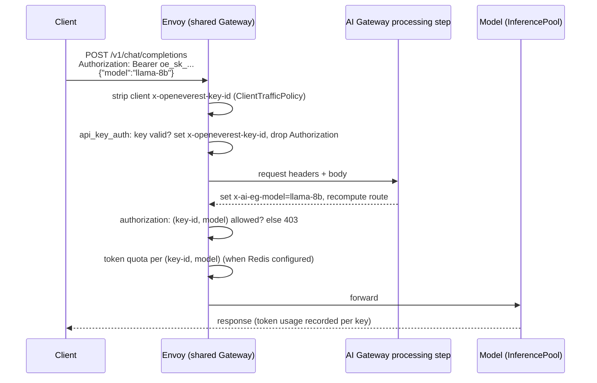

# Proposal: API keys for models exposed through the Envoy AI Gateway

- **Status:** Implemented (v1: one key per model). Results of the experiment are in section 5.
- **Date:** 2026-10-02
- **Scope:** `llm` topology with `externalAccess: EnvoyAIGateway`
- **Related user stories:** [4.1, 4.2, 4.3](../user-stories/04-security-compliance.md)

## 1. Goal

Production clients reach a model at `https://<gateway-hostname>/v1/...`, choose
the model with the OpenAI `model` field, and authenticate with
`Authorization: Bearer <key>`. Anthropic-style clients can send the key in
`x-api-key` instead (best effort, see 3.3).

- **Now:** one key per model Instance. It behaves like a database password: it is
  generated by the provider and shown in the Instance connection details.
- **Later, without a redesign:** keys per user or team that can access several
  models, and a possible move from Envoy Gateway policies to Kuadrant.

### Non-goals (this iteration)

- Keys per user or team, key objects in the UI/API, or expiry.
- Rotation with a grace period, where the old and new key both work for a while.
- Bringing your own key (referencing an existing Secret). Keys are always
  generated by the provider.
- Blocking in-cluster access to the model's ClusterIP Service. A NetworkPolicy
  for this is a separate follow-up (story 4.1).
- Replacing Envoy Gateway or the Envoy AI Gateway.

## 2. Key constraint

Envoy Gateway's API key check runs before the AI Gateway reads `model` from the
request body. Also, every `AIGatewayRoute` adds a catch-all `route-not-found`
rule. So a policy attached to one model's route would apply to whichever route
happens to match first, not to the requested model.

Envoy's authorization filter runs after the AI Gateway's processing step and does
see `x-ai-eg-model`. The design therefore uses two steps:

1. **Authenticate** at the Gateway level: any valid key is accepted, and Envoy
   forwards the key ID to later filters in a header.
2. **Authorize** at the Gateway level: allow the request only if this key ID may
   use this `x-ai-eg-model`.

## 3. Design

### 3.1 Credential Secret (the single source of truth, not tied to a gateway)

There is one Secret per key, stored in the namespace of the key's owner. The
provider generates it, and nothing outside the provider writes to it. The layout
follows Authorino's API key format, so Kuadrant can read the same Secrets later.

```yaml
apiVersion: v1
kind: Secret
type: Opaque
metadata:
  name: <instance>-ai-gateway-key          # v1 only; consumers select by label, never by name
  namespace: <instance-namespace>
  labels:
    openeverest.io/ai-gateway-key: "true"                 # selector for the renderer (and Authorino later)
    openeverest.io/ai-gateway-key-owner-kind: instance    # later: user | team | app
    openeverest.io/ai-gateway-key-owner-name: <instance>
    app.kubernetes.io/managed-by: provider-kserve
  annotations:
    openeverest.io/ai-gateway-key-id: <key-id>            # stable, not secret; forwarded to backends and metrics
    openeverest.io/ai-gateway-models: <ns>/<instance>     # comma-separated Instance refs this key may call
  ownerReferences: [<Instance>]                           # v1: garbage-collected with the Instance
stringData:
  api_key: oe_sk_<base64url(32 random bytes)>
```

| Field | Why it is shaped this way |
|---|---|
| `api_key` data key | Authorino's field name, so Kuadrant can read the Secret later without changes. |
| Ownership labels | Today the owner is always the Instance. For per-user keys, only the owner kind changes. |
| `ai-gateway-models` holds Instance refs, not model names | Instance refs are stable identities. The renderer turns them into served model names, so renaming a served model cannot silently grant or remove access. |
| `ai-gateway-models` is comma-separated | Entries are `<ns>/<name>`, which can never contain a comma or whitespace, so no escaping is needed. The value stays readable in `kubectl`, and a plain string split works in Go today and in CEL (Kuadrant) later. A JSON array would need a JSON parser on the CEL side. Canonical form: sorted, de-duplicated, no spaces. A future label selector gets its own annotation instead of overloading this one. |
| `ai-gateway-key-id` | Non-secret identity for authorization rules, rate-limit buckets, metrics and logs. One model can have several key IDs later, for rotation or per-user keys. |
| Key prefix `oe_sk_` | Lets secret scanners (for example, GitHub push protection custom patterns) detect leaked keys. |

**Key ID format:** `k_` followed by 16 random base32 characters. It is generated
once and kept unchanged across reconciles.

### 3.2 Generating the per-model key (Instance reconcile)

The new code goes in `internal/provider/apikey.go` and is called from
`syncAIGateway` before the `AIGatewayRoute` is applied.

1. Look up an existing key Secret using the owner labels.
2. If none exists, generate the key ID and value with `crypto/rand` and create
   the Secret. If one exists, never regenerate it. This keeps the reconcile
   idempotent.
3. Keep the labels and annotations in sync on every reconcile. Never rewrite
   `api_key`.
4. Add a watch on owned Secrets, filtered with a label predicate, so a deleted
   key Secret is regenerated promptly.

**Key lifetime follows the Instance, like a database password:**

| Event | What happens to the key |
|---|---|
| First time the Instance is exposed through the AI Gateway | Key is generated |
| Instance is deleted | Key Secret is removed. It is garbage-collected through the owner reference, and `Cleanup` also deletes it explicitly |
| Only the `LLMInferenceService` is deleted or recreated (Instance still exists) | Key is unchanged. The provider recreates the workload and the same key keeps working |
| `externalAccess` switched away from `EnvoyAIGateway` | Key Secret is kept but inactive: the renderer only resolves Instances that use the AI Gateway, so the key has no allow rule |
| `externalAccess` switched back to `EnvoyAIGateway` | Same key works again |

**Rotation (v1):** delete the Secret. The provider creates a new key, and the old
key stops working on the next render. Rotation with a grace period comes later
(section 6.1).

### 3.3 Gateway auth renderer (a single cluster-wide controller)

The renderer lives in `internal/provider/gatewayauth.go`, next to the route
builder it shares helpers with. It is registered in `cmd/provider/main.go`
through `r.GetManager()`. It uses one fixed reconcile key and the default single
worker. On every run it rebuilds the complete desired state, so it is idempotent
and needs no conflict handling.

**Inputs**

- All key Secrets labeled `openeverest.io/ai-gateway-key=true`, in all
  namespaces, read through the cached client. The provider runtime already
  caches Secrets cluster-wide for the connection Secret, so this adds no new
  informer.
- All `AIGatewayRoute`s attached to the shared Gateway. `<ns>/<instance>` is
  resolved to the model names the Instance's route actually matches, so
  authorization always follows what is routed. When gateway access is turned
  off, the route disappears and the key stops resolving.

**Outputs, all in the gateway namespace, owned by the Gateway (garbage-collected
with the chart)**

1. **Aggregated credentials Secret** (`<gateway>-api-keys`), with data
   `{<key-id>: <api_key>, ...}`. This is the format Envoy Gateway's `apiKeyAuth`
   expects. It always contains a random placeholder entry, so the policy stays
   valid when no keys exist.
2. **`SecurityPolicy`** targeting the shared Gateway:

```yaml
apiVersion: gateway.envoyproxy.io/v1alpha1
kind: SecurityPolicy
metadata:
  name: <gateway>-api-keys
  namespace: <gateway-namespace>
spec:
  targetRefs:
    - { group: gateway.networking.k8s.io, kind: Gateway, name: <gateway> }
  apiKeyAuth:
    credentialRefs: [{ name: <gateway>-api-keys }]
    extractFrom: [{ headers: [Authorization, x-api-key] }]  # first header present wins
    forwardClientIDHeader: x-openeverest-key-id
    sanitize: true                                   # do not forward the key to vLLM
  authorization:
    defaultAction: Deny
    rules:                                           # one rule per key
      - action: Allow
        principal:
          headers:                                   # every header must match; any value matches
            - { name: x-openeverest-key-id, values: [<key-id>] }
            - { name: x-ai-eg-model, values: [<served-model-name>, ...] }
```

`x-api-key` support is best effort. It only changes where the key is read from.
Whether Anthropic-format endpoints such as `/v1/messages` are routed is a
separate AI Gateway concern and out of scope. If the spike (section 5) shows
that the extra header is not stripped before forwarding, drop it from
`extractFrom` and support `Authorization` only.

**Failing closed**

- A route with no matching rule is denied. This covers a new model whose key has
  not been rendered yet, a deleted key, and a model reference that cannot be
  resolved.
- Keys that resolve to no model are left out of the credentials, so they get 401
  instead of authenticating and then being denied.
- If two routes on the Gateway share a served model name, the renderer leaves
  that name out of every rule and logs it (see 3.7).

Because the provider generates the policy, adding or removing a key changes only
the generated objects, not any user-visible API.

### 3.4 Header hygiene

- Chart: add a `ClientTrafficPolicy` on the Gateway with
  `headers.earlyRequestHeaders.remove: [x-openeverest-key-id]`. The experiment
  showed that Envoy's forwarding already overwrites a client-supplied value, so
  this is defense in depth.
- `x-ai-eg-model` is overwritten by the AI Gateway from the request body. The
  test matrix should include a client sending a mismatched header.

### 3.5 Token quotas and metrics

- In `buildTokenRateLimitPolicy`, change the `Distinct` selector from
  `x-user-id`, which the client controls, to `x-openeverest-key-id`.
  `tokenLimitPerHour` then means tokens per hour per key, per model. With one
  key per model this works out to a per-model budget; with per-user keys it
  becomes a per-user budget with no further changes.
- Set the AI Gateway chart value
  `controller.metricsRequestHeaderAttributes: "x-openeverest-key-id:openeverest.key.id"`
  (supported since v0.4). With one key per model, usage by key equals usage by
  model, so the dashboard is unchanged for now; a per-key panel comes with
  per-user keys. Cardinality is bounded by the number of keys.

### 3.6 Connection details

`aiGatewayConnectionDetails` returns the following:

| Field | Value |
|---|---|
| `URI` | `https://<gateway-hostname>/v1`, ready to paste as the OpenAI `base_url`. This changes the current behaviour, which has no path (`gatewayConnectionDetails`). |
| `Username` | key ID (non-secret identifier) |
| `Password` | `api_key` |
| `AdditionalProperties["model"]` | served model name to put in the `model` field |

The values land in the existing `<instance>-conn` Secret, and the UI shows them
the same way it shows database credentials. The UI keeps the "Password" label
for now.

### 3.7 Validation (`validateLLM`)

- If `aiGateway.auth.enabled` is set and the Gateway uses plain HTTP, reject the
  Instance unless `aiGateway.auth.allowInsecureHTTP` is set (for local
  development). Keys must never cross the network in clear text.
- The served model name must be unique across all `AIGatewayRoute`s on the
  shared Gateway, with or without API keys (a duplicate also makes routing
  ambiguous). Authorization decisions use the model name, so a duplicate would
  let one key reach another Instance.

### 3.8 Chart, configuration, RBAC

```yaml
aiGateway:
  auth:
    # -- Require an API key for every request through the shared AI Gateway
    enabled: true
    # -- Allow API keys over plain HTTP (local development only)
    allowInsecureHTTP: false
```

- New environment variables: `AI_GATEWAY_AUTH_ENABLED` and
  `AI_GATEWAY_AUTH_ALLOW_INSECURE_HTTP`, with accessors in
  `internal/common/spec.go`.
- The chart fails rendering when `auth.enabled && !tls.enabled && !auth.allowInsecureHTTP`.
- New templates: the `ClientTrafficPolicy`, and an update to the AI Gateway
  subchart values.
- RBAC markers: `gateway.envoyproxy.io` `securitypolicies` (full CRUD). Secrets
  are already granted cluster-wide. Regenerate `config/rbac/role.yaml`.
- When `auth.enabled=false`, the renderer deletes its `SecurityPolicy` and
  aggregated Secret, and connection details leave out the key.

## 4. Request flow



## 5. Experiment results and work breakdown

0. **Experiment on a throwaway k3d cluster** with Envoy Gateway v1.5.9, AI
   Gateway v0.4.0, two fake OpenAI backends (`ai-gateway-testupstream`) in
   different namespaces, a hand-written Gateway-level `SecurityPolicy`, and
   Redis-backed global rate limiting. All confirmed:
   - [x] `apiKeyAuth` strips the `Bearer ` prefix (a raw key also works).
   - [x] A key in `x-api-key` is accepted, and with `sanitize: true` neither
     `Authorization` nor `x-api-key` reaches the backend, while the forwarded
     key ID does.
   - [x] The authorization filter sees the `x-ai-eg-model` the AI Gateway sets
     from the body: key A for model B gets 403, key A for model A gets 200, and
     a client-sent `x-ai-eg-model` header cannot override the body.
   - [x] The forwarded key ID cannot be spoofed, even without the
     `ClientTrafficPolicy` (Envoy overwrites the header).
   - [x] The rate-limit selector on the forwarded header buckets per key: one
     key hits 429 while another key for the same model still gets 200.
   - [x] A key can be allowed several models (the per-user future).
   - [x] A rotated key value takes effect within a second.
   - Unknown model with a valid key gets 403 rather than 404.

   The provider was then run against the same cluster with real Instances. It
   generated the key Secrets and rendered the policy; the matrix gave 401
   without a key, 403 for another model's key and for spoofed key IDs, and
   passed authorization for the right key. A duplicate served model name was
   rejected by validation. Connection details showed `uri: http://<gw>/v1`, the
   key ID, the key and the model. Lifecycle checks passed: the key is kept
   (with 401) while gateway access is off and works again when it is back on;
   deleting the key Secret rotates it; deleting the Instance removes the key.
   Not covered: a real vLLM backend behind an `InferencePool` (the experiment
   had no KServe controllers, so allowed requests ended in 500 after passing
   authorization). Verify that on the Tilt stack.
1. **Key Secret and connection details:** `apikey.go`, changes to `aigateway.go`
   (including the `/v1` URI), `statusLLM`, the owned-Secret watch, and an
   explicit delete in `Cleanup`. Done, with unit tests.
2. **Renderer:** `gatewayauth.go`, registration in `main.go`, RBAC markers.
   Done, with unit tests for key resolution, the policy builder and the
   reconcile loop (fake client).
3. **Validation:** require TLS and unique served model names. Done.
4. **Chart:** `aiGateway.auth` values, environment variables,
   `ClientTrafficPolicy`, the fail guard, AI Gateway metric attributes. Done;
   the Tilt setup sets `allowInsecureHTTP`.
5. **Quotas and metrics:** rate-limit selector change. Done.
6. **Docs and dev:** README, TLS and deployment guides, the Tilt sample `curl`.
   Done.

## 6. Future direction (designed for, not built now)

## 6. Future direction (designed for, not built now)

### 6.1 Keys per user or team

- A new key resource (for example `ModelAccessKey`, either a provider CRD or an
  OpenEverest core API) produces the same credential Secrets, with:
  - `owner-kind: user|team|app`;
  - `ai-gateway-models` listing several Instances, or later a label selector;
  - optional `expires-at` and quota-tier annotations.
- Permission to create a key for a model is checked against OpenEverest RBAC
  (for example, "can use Instance X").
- Rotation with a grace period becomes: create a second key Secret for the same
  owner, then delete the old one.
- **The renderer, the request flow and the client contract stay the same.**
  The per-model key from v1 becomes simply a key with one allowed model.

### 6.2 Moving to Kuadrant

| Today (Envoy Gateway) | Kuadrant |
|---|---|
| Aggregated Secret + `apiKeyAuth` | `AuthPolicy` API key identity selecting `openeverest.io/ai-gateway-key=true` in all namespaces, with credentials taken from `Authorization` and prefix `Bearer` |
| One `authorization` rule per key | `AuthPolicy` rule using the key's `ai-gateway-models` annotation and the requested model |
| Forwarded `x-openeverest-key-id` | Identity metadata (`auth.identity.metadata.annotations[...]`), injected as the same header so metrics keep working |
| `BackendTrafficPolicy` token limit | `TokenRateLimitPolicy` per key ID or tier |

The credential Secrets are not touched. Only the renderer's outputs change.
Before migrating, check that Kuadrant's filter on Envoy Gateway runs after the
AI Gateway's processing step.

## 7. Decisions

- The key ID is random (`k_` + 16 random base32 characters).
- The key lives as long as the Instance. It is removed when the Instance is
  deleted and kept when gateway access is turned off (section 3.2).
- The UI keeps the "Password" label for now.
- Keys are accepted from `Authorization: Bearer` and, best effort, from
  `x-api-key` (section 3.3).
- `ai-gateway-models` is a comma-separated list in canonical form (section 3.1).
- The connection details URI includes `/v1` (section 3.6).
- No bring-your-own key in v1.

## 8. Risks

- **Fail-open window:** avoided because the authorization default is Deny and
  model routes are denied until their rule is rendered.
- **Cost of a full rebuild:** every key change re-sends the whole policy to
  Envoy. This is fine for hundreds of keys. Per-user keys at scale are the point
  where moving to Kuadrant pays off.
- **Plain-text keys at rest:** both Envoy Gateway and Authorino compare keys
  stored in plain text. Mitigate with Secret RBAC and encryption at rest, and
  never log key values.
- **In-cluster bypass:** pods can still call the model Service directly. Close
  this with a NetworkPolicy (story 4.1 follow-up).
- **Version end-of-life:** Envoy Gateway v1.5 has reached end of life. The design
  uses only `SecurityPolicy` fields that are stable in later versions, so it
  should survive the AI Gateway v0.7+ / Envoy Gateway 1.8+ upgrade.
